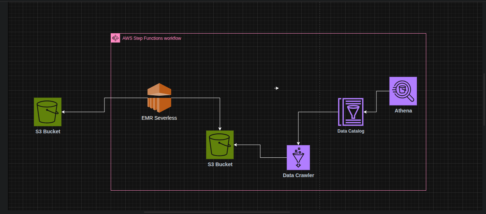

# Vehicle Rental Analytics Project

## Overview
This project processes vehicle rental data to generate performance metrics and analytics using Apache Spark on AWS EMR Serverless, AWS Glue, and AWS Athena. It consists of two main Spark jobs that process vehicle, location, and user transaction data, followed by Glue crawlers to catalog the data and an Athena query to generate a summary report. The workflow is orchestrated using AWS Step Functions.



## Project Structure
- **Scripts**:
  - `vehicle_location_metrics.py`: Processes vehicle and location performance metrics.
  - `user_transaction_metrics.py`: Analyzes user engagement and daily transaction metrics.
- **Step Function**:
  - `step_function.json`: Defines the AWS Step Functions workflow to orchestrate Spark jobs, Glue crawlers, and Athena queries.
- **Data**:
  - Input data is stored in `s3://emr.rawdata/` with subdirectories for `vehicles/`, `locations/`, `users/`, and `rental_transactions/`.
  - Processed output is written to `s3://emr.processed/` in subdirectories `job1/` and `job2/`.
  - Logs are stored in `s3://emr.processed/logs/`.
  - Athena query results are stored in `s3://query.output/`.

## Prerequisites
- AWS account with permissions to:
  - Run EMR Serverless jobs.
  - Execute AWS Glue crawlers.
  - Query Athena.
  - Access S3 buckets for input, output, logs, and scripts.
- AWS CLI configured with appropriate credentials.
- Input data in CSV format in the specified S3 paths.
- AWS Glue crawlers (`dailyCrawler`, `location_metric`, `userCrawler`, `vehicle_metrics`) set up to catalog output data.
- Athena database `emr_job` configured.

## Setup
1. **Upload Scripts**:
   - Place `vehicle_location_metrics.py` and `user_transaction_metrics.py` in `s3://emr.job.script/`.
2. **Configure S3 Buckets**:
   - Ensure input data is available in `s3://emr.rawdata/vehicles/`, `s3://emr.rawdata/locations/`, `s3://emr.rawdata/users/`, and `s3://emr.rawdata/rental_transactions/`.
   - Create output buckets: `s3://emr.processed/` and `s3://query.output/`.
3. **Set Up Glue Crawlers**:
   - Create Glue crawlers named `dailyCrawler`, `location_metric`, `userCrawler`, and `vehicle_metrics` to catalog the output Parquet files in `s3://emr.processed/`.
4. **Deploy Step Function**:
   - Deploy `step_function.json` in AWS Step Functions, ensuring the correct `ApplicationId` and `ExecutionRoleArn` for EMR Serverless.
5. **Athena Configuration**:
   - Ensure the `emr_job` database exists in Athena and is accessible.

## Workflow
The workflow is defined in `step_function.json` and executed via AWS Step Functions:
1. **Parallel Spark Jobs**:
   - **Vehicle Metrics Job** (`vehicle_location_metrics.py`):
     - Reads vehicle, location, and transaction data.
     - Generates two Parquet files:
       - `location_performance_metrics`: KPIs like revenue, transaction count, and unique vehicles per location.
       - `vehicle_type_performance_metrics`: KPIs like total rental duration, revenue, and transactions by vehicle type.
   - **User Metrics Job** (`user_transaction_metrics.py`):
     - Reads user and transaction data.
     - Generates two Parquet files:
       - `daily_transaction_metrics`: Daily KPIs like revenue, transaction count, and unique users.
       - `user_engagement_metrics`: User-level KPIs like total spending, transaction count, and rental duration.
2. **Parallel Glue Crawlers**:
   - Runs four Glue crawlers (`dailyCrawler`, `location_metric`, `userCrawler`, `vehicle_metrics`) to catalog the Parquet outputs in the `emr_job` database.
3. **Athena Query**:
   - Executes a sample query to select the top 10 days by revenue from `daily_transaction_metrics`.
   - Results are saved to `s3://query.output/`.
4. **Success State**:
   - Workflow completes successfully if all steps execute without errors.

## Usage
1. **Run the Step Function**:
   - Start the Step Function execution via the AWS Step Functions console or CLI:
     ```bash
     aws stepfunctions start-execution --state-machine-arn <your-state-machine-arn>
     ```
2. **Monitor Execution**:
   - Check the Step Functions console for execution status.
   - View logs in `s3://emr.processed/logs/` for debugging.
3. **Access Results**:
   - Parquet files are available in `s3://emr.processed/job1/` and `s3://emr.processed/job2/`.
   - Athena query results are in `s3://query.output/`.
   - Query the `emr_job` database in Athena for further analysis.

## Error Handling
- Each Spark job retries up to 3 times with a 30-second interval and exponential backoff.
- The Athena query retries up to 2 times with a 15-second interval.
- Failures are captured in the Step Function's `Catch` blocks, transitioning to failure states (`Vehicle Metrics Job Failed` or `User Metrics Job Failed`).

## Output
- **Location Performance Metrics** (`s3://emr.processed/job1/location_performance_metrics`):
  - Columns: `pickup_location`, `revenue_per_location`, `total_transactions_per_location`, `average_transaction_amount`, `max_transaction_amount`, `min_transaction_amount`, `unique_vehicles_used`.
- **Vehicle Type Performance Metrics** (`s3://emr.processed/job1/vehicle_type_performance_metrics`):
  - Columns: `vehicle_type`, `total_rental_duration`, `average_rental_duration`, `revenue_by_vehicle_type`, `total_transactions_by_vehicle_type`, `average_transaction_amount_by_vehicle_type`.
- **Daily Transaction Metrics** (`s3://emr.processed/job2/daily_transaction_metrics`):
  - Columns: `rental_date`, `total_transactions_per_day`, `revenue_per_day`, `average_transaction_value`, `max_transaction_amount_daily`, `min_transaction_amount_daily`, `unique_users_per_day`.
- **User Engagement Metrics** (`s3://emr.processed/job2/user_engagement_metrics`):
  - Columns: `user_id`, `user_total_spending`, `user_total_transactions`, `user_average_spending`, `user_total_rental_hours`, `user_average_rental_duration`, `user_max_transaction_amount`, `user_min_transaction_amount`.
- **Athena Query Results** (`s3://query.output/`):
  - Contains results of the sample query (top 10 days by revenue).

## Notes
- Ensure input CSV files have headers and consistent column names.
- Update the `ApplicationId` and `ExecutionRoleArn` in `step_function.json` to match your AWS environment.
- The Athena query in `step_function.json` is a sample; modify it to suit your reporting needs.
- Monitor S3 storage costs, as Parquet files and logs can accumulate over time.

## Troubleshooting
- **Spark Job Failures**: Check logs in `s3://emr.processed/logs/` for errors related to data schema or S3 permissions.
- **Glue Crawler Issues**: Verify crawler configurations and ensure output Parquet files are correctly formatted.
- **Athena Query Failures**: Confirm the `emr_job` database and tables exist and are accessible.
- **Step Function Errors**: Review the execution history in the Step Functions console for detailed error messages.